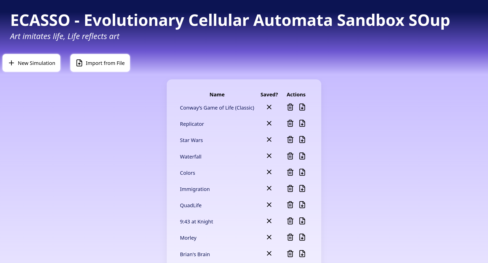
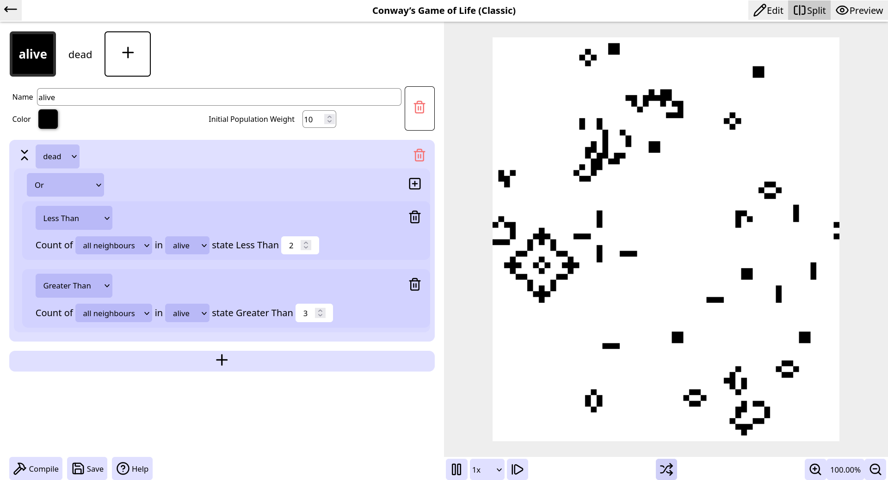
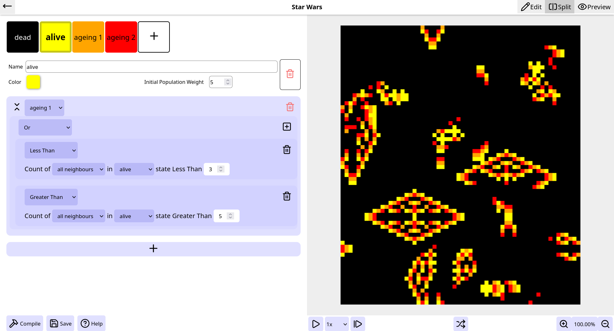
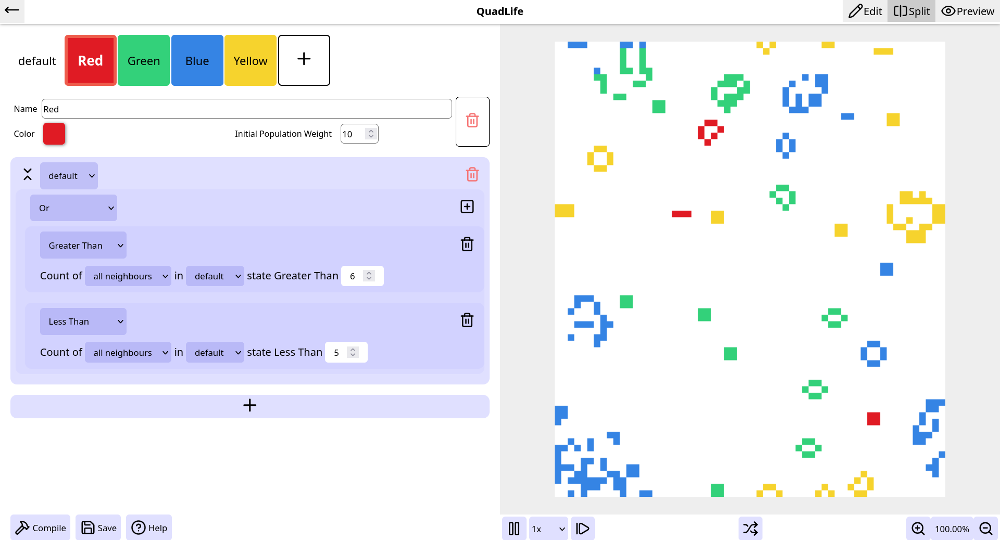
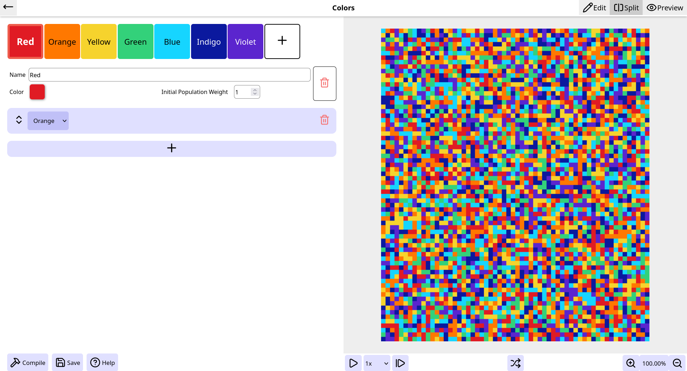
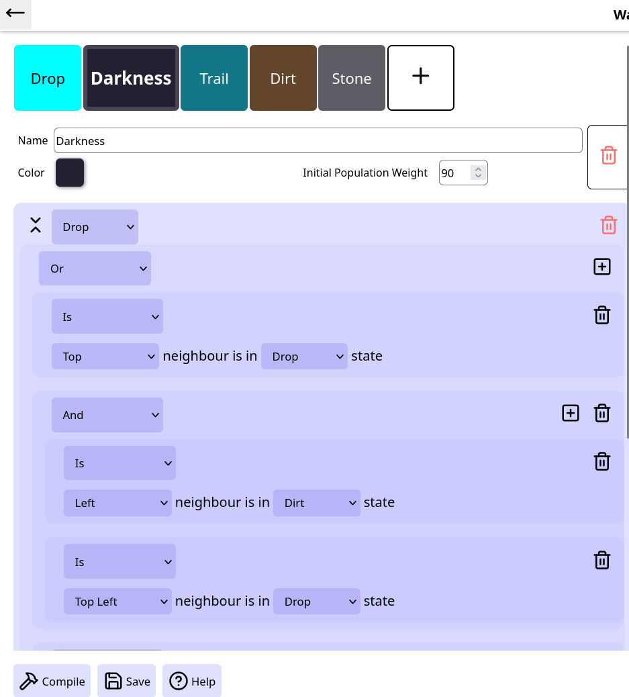

# ecasso
ECASSO - Evolutionary Cellular Automata Sandbox SOup

*Art imitates life, Life reflects art*

## Whats's it
ECASSO is a simulator for [Cellular Automata](https://en.wikipedia.org/wiki/Cellular_automaton) like [Conway's Game of Life](https://en.wikipedia.org/wiki/Conway's_Game_of_Life) which supports customizable rules.

## Features
- Customizable rules using operators like Relational, Logical AND/OR, Range, In, Is, Random and Majority. 
- No limit on number of states
- 20+ Presets to start from
- Save the created simulations to local storage. It always stay on your device; No account needed!
- Export to file for sharing and backup 

## Installation
``` shell
npm install
npm start
```

## Gallery








